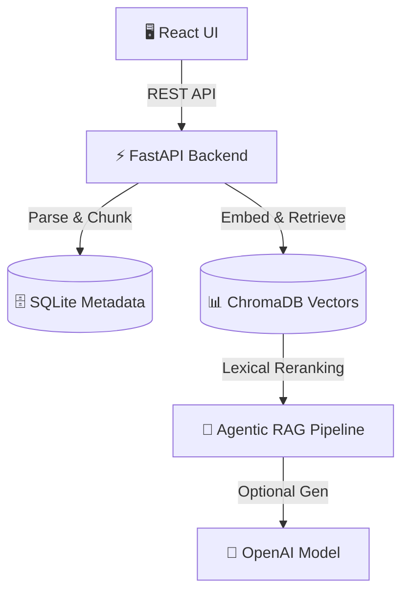

<div align="center">


[](https://git.io/typing-svg)

**Production-style RAG assistant with persistent document indexing, source-grounded answers, agent traceability, guardrails, and an LLM evaluation dashboard.**


</div>

---

## 🚀 Why RAGLens?

Most GenAI portfolio projects stop at a simple PDF chatbot. **RAGLens** adds the critical components companies actually care about in production: 

*Persistence • Retrieval Transparency • Answer Confidence • Citation Coverage • Hallucination Risk • Latency & Cost Tracking • Prompt-Injection Guardrails • RAG Evaluation*

<details>
<summary><b>🎬 Click to expand Demo Flow</b></summary>

1. Start the backend and frontend.
2. Click `Load sample docs`, or upload files from `backend/sample_docs`.
3. Ask one of these questions:
   - `What is the incident response policy?`
   - `When should AI-generated customer replies be reviewed?`
   - `What metrics are reviewed for model usage?`
4. Inspect the answer, source chunks, and evaluation dashboard.
5. Inspect the agent trace to see guardrail, retrieval, reranking, generation, and evaluation steps.
6. Click `Run RAG eval` to run the built-in evaluation suite.
7. Click `Export` to generate a Markdown answer report.
</details>

---

## ✨ Interactive Features

| 🧠 Knowledge Core | 🛡️ Trust & Safety | 📊 Observability |
|:---|:---|:---|
| 📄 Upload `.txt`, `.md`, `.pdf`, `.docx`, and `.csv` | 🛑 Blocks prompt-injection attempts | ⏱️ Tracks latency & token estimates |
| 🗄️ SQLite metadata & ChromaDB vector storage | 🔍 Visible source chunk citations | 💰 Cost estimation dashboard |
| 🔀 Local deterministic or OpenAI embeddings | 📉 Tracks hallucination & risk scores | 🤖 Agent execution traces |
| ⚡ Lexical reranking for precise retrieval | ✅ Built-in RAG evaluation suite | 💾 Markdown export & query history |

---

## 🛠️ Quick Start

You can run RAGLens locally using Docker or manually via the terminal.

### 🐳 The Easy Way (Docker Compose)

```bash
git clone https://github.com/maniktomar/RAGLens.git
cd RAGLens
docker compose up --build
```
> 🌐 **App:** `http://localhost:8080` | **API:** `http://localhost:8001`

*(Want OpenAI-powered generation? Add your API key before running):*
```powershell
$env:OPENAI_API_KEY="sk-your_key_here"
$env:USE_OPENAI_EMBEDDINGS="true"
docker compose up --build
```

### 💻 Manual Setup

<details>
<summary><b>Backend Setup (FastAPI)</b></summary>

```bash
cd backend
python -m venv .venv
# Activate environment (Windows)
.\.venv\Scripts\Activate.ps1
# Activate environment (Mac/Linux)
source .venv/bin/activate

pip install -r requirements.txt
cp .env.example .env
uvicorn app.main:app --reload
```
</details>

<details>
<summary><b>Frontend Setup (React)</b></summary>

```bash
cd frontend
npm install
npm run dev
```
Open `http://localhost:5173`.
</details>

---

## 🏗️ System Architecture



*The local version uses deterministic local embeddings so the project runs 100% free without paid APIs. Set `USE_OPENAI_EMBEDDINGS=true` with a valid `OPENAI_API_KEY` to unlock semantic embeddings.*

---

## 💼 Resume Bullets

- **Enterprise Stack:** Built a full-stack enterprise RAG assistant with FastAPI, React, persistent document indexing, ChromaDB vector retrieval, reranking, source citations, and query history.
- **Analytics & Observability:** Added an evaluation dashboard that tracks confidence, citation coverage, retrieval relevance, hallucination risk, latency, token estimates, cost, and benchmark pass rate.
- **AI Safety:** Implemented prompt-injection guardrails and an agent trace showing guardrail, retrieval, reranking, generation, and evaluation stages.

<div align="center">
  <i>Built by Manik Tomar</i>
</div>
